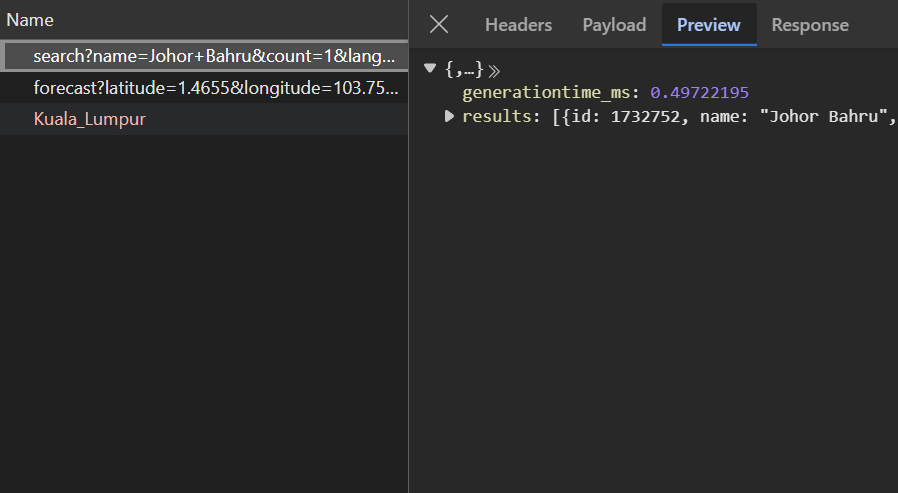
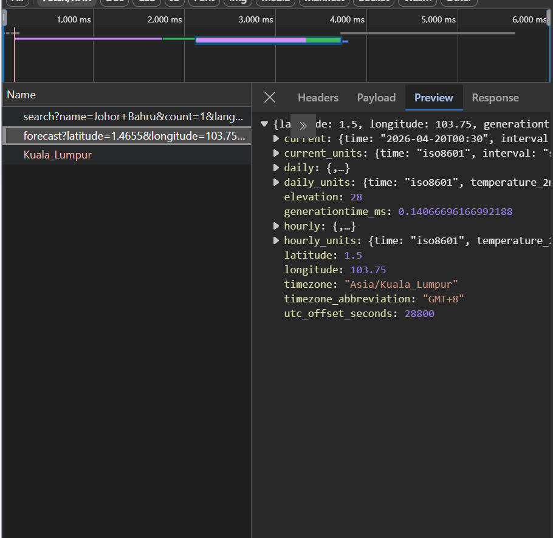
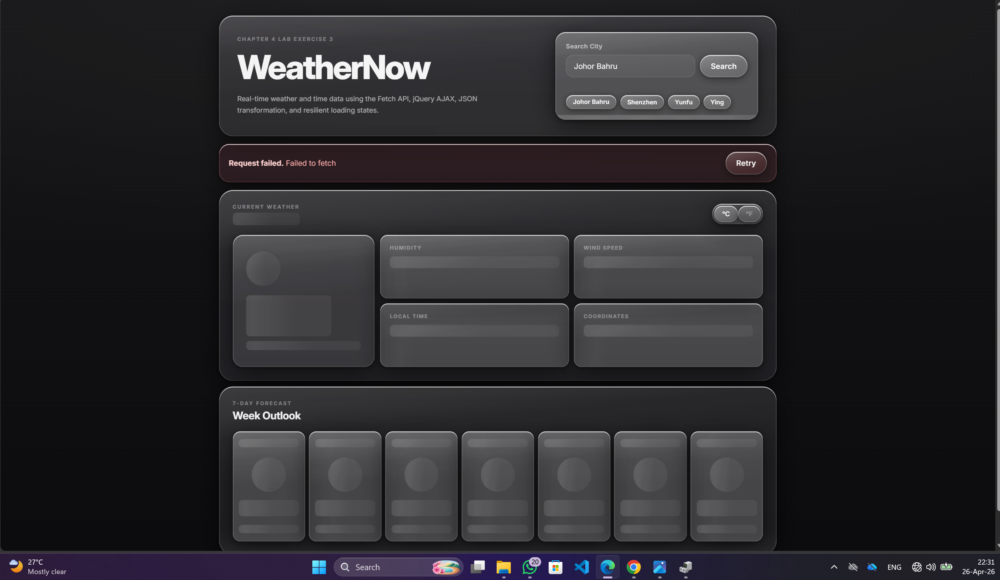

# Lab Exercise 3

## WeatherNow - JSON, AJAX, Fetch API, and jQuery

This lab builds a real-time weather dashboard using:
- Fetch API with `async/await` for geocoding and weather requests
- jQuery `$.getJSON()` for local time lookup
- JSON transformation for weather code labels and icons
- skeleton loading states, validation, timeout handling, and retry UI

## Project Files

- [index.html](./index.html)
- [style.css](./style.css)
- [app.js](./app.js)
- [reflection.md](./reflection.md)

## Deliverables Preview

### Successful API Call Screenshots

<table>
  <tr>
    <td align="center">
      
       
      <strong>Geocoding API response</strong>
    </td>
    <td align="center">
      
       
      <strong>Weather API response</strong>
    </td>
  </tr>
</table>

### Error State UI

  

## Reflection Summary

From my perspective, the Fetch API was a better fit for handling the request to get geocoding information and weather data because the handling of dependent requests becomes clearer when using async/await. Fetch API is slightly more verbose since you have to handle the response.ok, manually parse the JSON object, and set timeouts with AbortController. But Fetch API provides more control over the whole request process.

The jQuery AJAX method was handy when it came to getting the local time because the methods  `.done()`, `.fail()`, and `.always()` provided a quick way of handling the request. But it seems to be more rigid in case of handling more complex errors. Therefore, I would consider Fetch API as the best solution.

When it comes to error handling, I had to use try/catch along with checking the HTTP status and handling possible aborts from AbortController within the single structured flow in case of Fetch API while using `$.getJSON()`. Its error handling is very succinct as there is no much you can do with jQuery fail callback, so it may become cumbersome when more error cases come up.

The last factor is the matter of browser support as before jQuery was much better at that. However, since jQuery has become outdated recently, Fetch API enjoys the most recent browser implementations and, therefore, better suited for today's JavaScript development. Fetch API has readability and flexibility with dependent requests. Besides, it is easily scalable which is another great feature of it.
