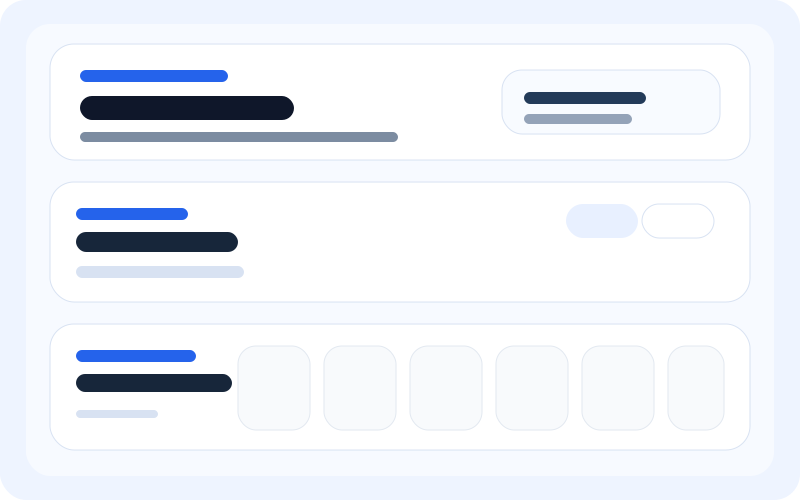

# SCSM2223-04CPAD

## ZUO BOYU A24CS4045 Projects

<table>
  <tr>
    <td align="center">
      
       
      <strong><a href="./lab1/">lab1</a></strong>
    </td>
    <td align="center">
      
       
      <strong><a href="./lab1B/">lab1B</a></strong>
    </td>
  </tr>
  <tr>
    <td align="center">
      
       
      <strong><a href="./Lab2/">Lab2</a></strong>
    </td>
    <td align="center">
      
       
      <strong><a href="./QuickNotes_Lab_StepByStep/">QuickNotes_Lab_StepByStep</a></strong>
    </td>
  </tr>
  <tr>
    <td align="center">
      
       
      <strong><a href="./Lab_Exercise_3/">Lab_Exercise_3</a></strong>
    </td>
    <td></td>
  </tr>
</table>

## Lab Exercise 3

  <strong>WeatherNow - JSON, AJAX, Fetch API, and jQuery</strong> 
  Folder: <a href="./Lab_Exercise_3/">Lab_Exercise_3</a> 
  Submission document: <a href="./Lab_Exercise_3/reflectionand%20screenshot.docx">reflectionand screenshot.docx</a>

  This exercise uses the Fetch API for the geocoding to weather request chain and jQuery <code>$.getJSON()</code>
  for local time lookup. Based on the written reflection in the submitted document, Fetch was preferred because
  it is easier to read for dependent requests, scales better, and gives stronger control over HTTP checks,
  JSON parsing, and <code>AbortController</code> timeouts. jQuery AJAX was useful for short requests because the
  <code>.done()</code>, <code>.fail()</code>, and <code>.always()</code> pattern is concise, but it felt less flexible
  once more complex error handling was needed.

<table>
  <tr>
    <td align="center">
      
       
      <strong>Geocoding API response</strong>
    </td>
    <td align="center">
      
       
      <strong>Weather API response</strong>
    </td>
  </tr>
  <tr>
    <td align="center">
      
       
      <strong>Error state UI</strong>
    </td>
    <td></td>
  </tr>
</table>

## Lab2 Demo

  

https://github.com/user-attachments/assets/0e308d67-5926-4e80-b936-f8a6ed7bfb50

  <strong>Watch the Lab2 demo video</a></strong> 
  
  Compressed 1080p MP4, under 10 MB.

