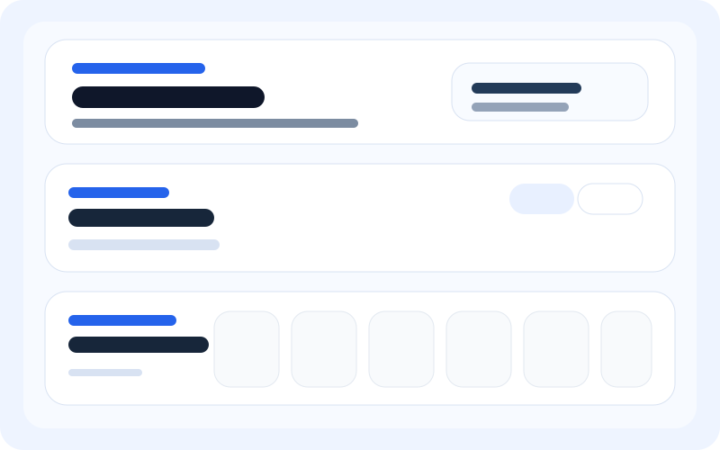
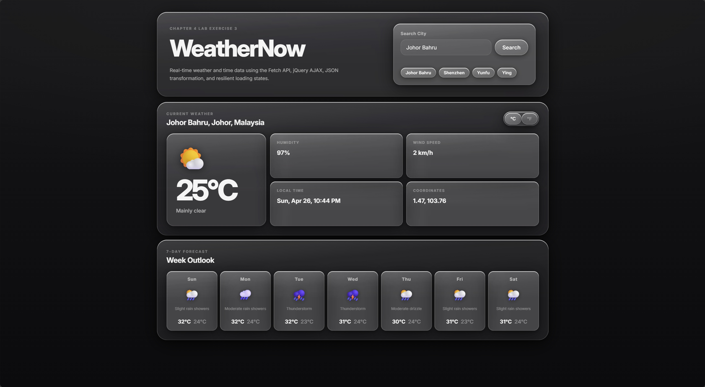
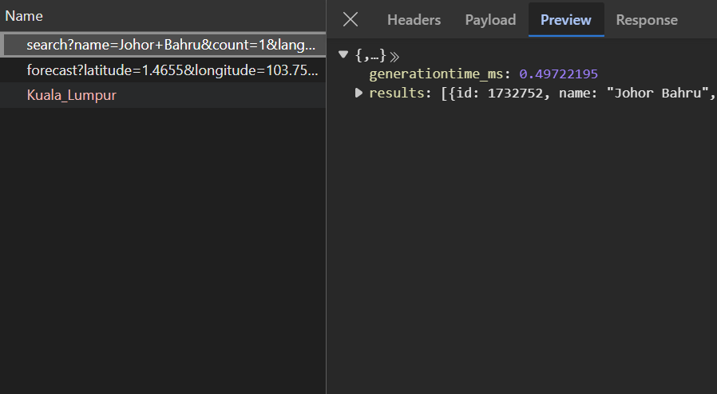
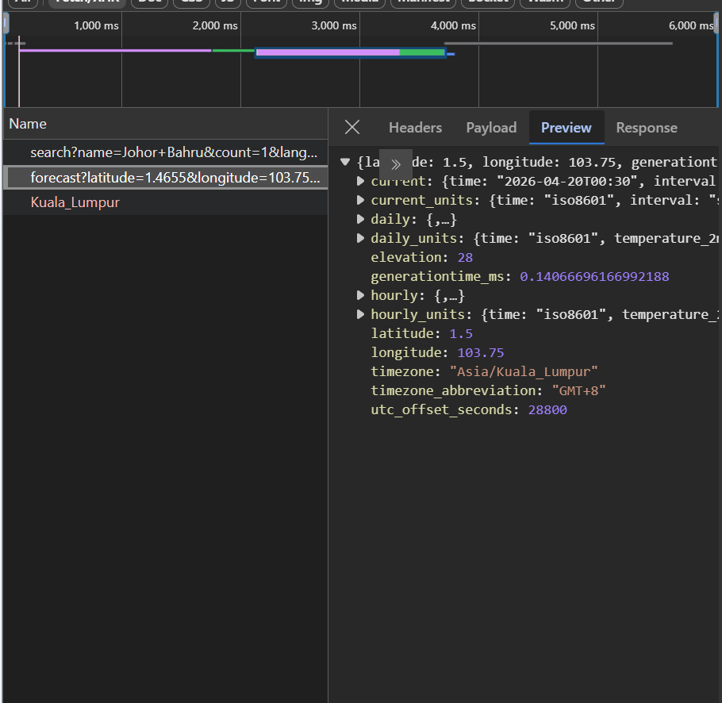
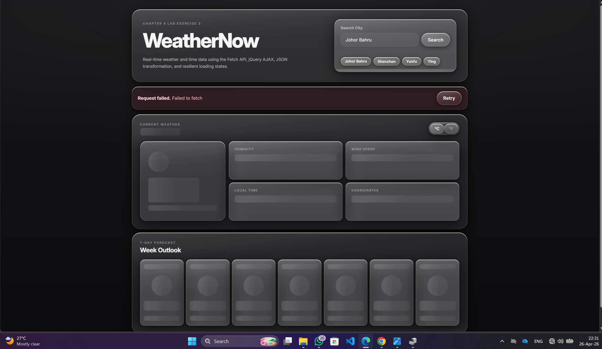

# SCSM2223-04CPAD

## ZUO BOYU A24CS4045 Projects

<table>
  <tr>
    <td align="center">
      <a href="./lab1/">
        
      </a>
      <br>
      <strong><a href="./lab1/">lab1</a></strong>
    </td>
    <td align="center">
      <a href="./lab1B/">
        
      </a>
      <br>
      <strong><a href="./lab1B/">lab1B</a></strong>
    </td>
  </tr>
  <tr>
    <td align="center">
      <a href="./Lab2/">
        
      </a>
      <br>
      <strong><a href="./Lab2/">Lab2</a></strong>
    </td>
    <td align="center">
      <a href="./QuickNotes_Lab_StepByStep/">
        
      </a>
      <br>
      <strong><a href="./QuickNotes_Lab_StepByStep/">QuickNotes_Lab_StepByStep</a></strong>
    </td>
  </tr>
  <tr>
    <td align="center">
      <a href="./Lab_Exercise_3/">
        
      </a>
      <br>
      <strong><a href="./Lab_Exercise_3/">Lab_Exercise_3</a></strong>
    </td>
    <td align="center">
      <a href="./ch8/student-records-app/">
        <strong>Chapter 8</strong>
      </a>
      <br>
      <strong><a href="./ch8/student-records-app/">Student Records App</a></strong>
    </td>
  </tr>
</table>

## Chapter 8 Student Records App

<p>
  <strong>Student Records Manager - Vue 3, Axios, Express, and MySQL</strong><br>
  Folder: <a href="./ch8/student-records-app/">ch8/student-records-app</a>
</p>

This project is a full stack CRUD application for managing student records. The frontend is built with Vue 3 and Vite, the API uses Express, and the data is stored in a MySQL database named <code>student_records</code>.

### Project Structure

```text
ch8/student-records-app/
  server/              Express API and MySQL connection
  sql/schema.sql       Database schema and sample records
  src/                 Vue frontend source files
  test.http            API request examples
  package.json         Frontend dependencies and scripts
```

The repository excludes dependency folders. Run <code>npm install</code> in the frontend folder and in the backend folder after cloning.

### Database Setup

1. Start MySQL.
2. Import <a href="./ch8/student-records-app/sql/schema.sql">sql/schema.sql</a>.
3. Confirm the backend connection settings in <a href="./ch8/student-records-app/server/db.js">server/db.js</a>.

The default backend configuration expects:

```text
host: localhost
port: 3306
user: root
password:
database: student_records
```

### Run The Backend

```bash
cd ch8/student-records-app/server
npm install
node index.js
```

The API runs at <code>http://localhost:3000</code>.

### Run The Frontend

Open another terminal:

```bash
cd ch8/student-records-app
npm install
npm run dev
```

The Vite app usually runs at <code>http://localhost:5173</code>.

### API Endpoints

```text
GET    /                Health check
GET    /students        List students, with optional q, sortBy, and order query params
GET    /students/:id    Get one student
POST   /students        Create a student
PUT    /students/:id    Update a student
DELETE /students/:id    Delete a student
```

### Features

- List student records from MySQL.
- Add new student records.
- Edit existing student details.
- Delete student records.
- Search and sort through the API.
- Use Axios request and response interceptors for frontend API calls.

## Lab Exercise 3

<p>
  <strong>WeatherNow - JSON, AJAX, Fetch API, and jQuery</strong><br>
  Folder: <a href="./Lab_Exercise_3/">Lab_Exercise_3</a><br>
  Reflection: <a href="./Lab_Exercise_3/reflection.md">reflection.md</a>
</p>

<p>
  <strong>Web Preview</strong><br>
  GitHub cannot render a live interactive HTML app directly inside a README, so the preview below links to the project files.
</p>

<p align="center">
  <a href="./Lab_Exercise_3/">
    
  </a>
</p>

<p>
  This exercise uses the Fetch API for the geocoding to weather request chain and jQuery <code>$.getJSON()</code>
  for local time lookup. Based on the written reflection in the submitted document, Fetch was preferred because
  it is easier to read for dependent requests, scales better, and gives stronger control over HTTP checks,
  JSON parsing, and <code>AbortController</code> timeouts. jQuery AJAX was useful for short requests because the
  <code>.done()</code>, <code>.fail()</code>, and <code>.always()</code> pattern is concise, but it felt less flexible
  once more complex error handling was needed.
</p>

<table>
  <tr>
    <td align="center">
      <a href="./assets/lab3-screenshots/image2.png">
        
      </a>
      <br>
      <strong>Geocoding API response</strong>
    </td>
    <td align="center">
      <a href="./assets/lab3-screenshots/image3.png">
        
      </a>
      <br>
      <strong>Weather API response</strong>
    </td>
  </tr>
  <tr>
    <td align="center">
      <a href="./assets/lab3-screenshots/image1.png">
        
      </a>
      <br>
      <strong>Error state UI</strong>
    </td>
    <td></td>
  </tr>
</table>

## Lab2 Demo

<p>
  <a href="./Lab2/demo.mp4">
    
  </a>
</p>


https://github.com/user-attachments/assets/0e308d67-5926-4e80-b936-f8a6ed7bfb50


<p>
  <strong>Watch the Lab2 demo video</a></strong><br>
  
  Compressed 1080p MP4, under 10 MB.
</p>
