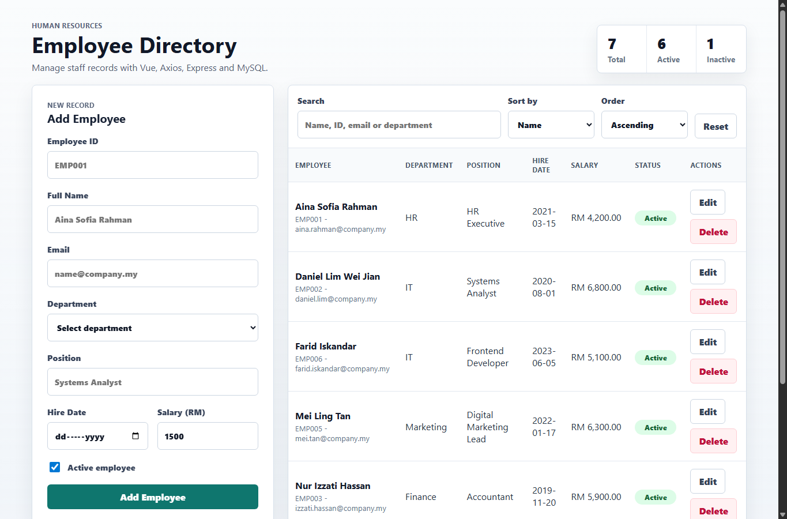
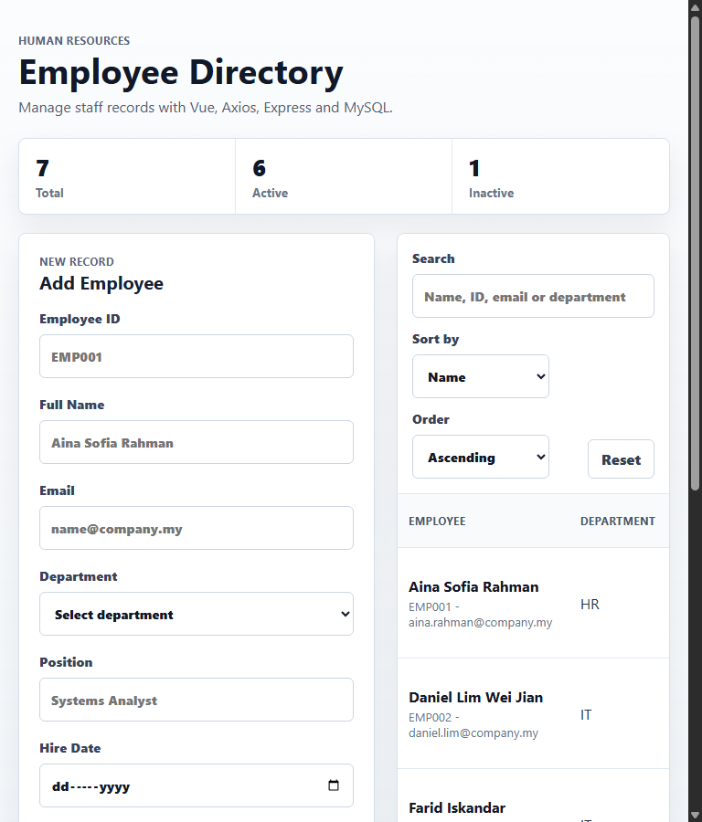

# Employee Directory Report

**Name:** ZUO BOYU &nbsp;|&nbsp; **Matric Number:** A24CS4045 &nbsp;|&nbsp; **Course:** Cross Platform Application Development &nbsp;|&nbsp; **Chapter:** 8 – Connecting Vue to Backend

---

## 1. Working UI Screenshots

The application is a single-page Vue 3 frontend talking to an Express + MySQL backend. Figure 1 shows the laptop view with the summary cards, add/edit form, search and sort controls, paginated table, active/inactive badges, and Malaysian Ringgit salary formatting. Figure 2 shows the same UI re-flowed at tablet width: the form stacks above the table, summary cards wrap, and no horizontal scrolling is needed.

*Figure 1. Laptop view (≥1024 px). Summary cards, paginated table with badges, RM-formatted salary, and edit/delete actions.*

*Figure 2. Tablet view (≥768 px). The CSS grid in `App.vue` collapses to a single column.*

---

## 2. Chapter 8 Learning Outcomes – Code Evidence

| Learning Outcome | How the project satisfies it | Where to look (file : line) |
| --- | --- | --- |
| **LO1.** Connect Vue to a REST backend and manage the request/response lifecycle. | `App.vue` holds the `employees` array and a `loading` flag. `onMounted` triggers `loadEmployees()`, which awaits the API and updates state; errors surface via an `errorMessage` banner. | `src/App.vue:28` — `onMounted(loadEmployees)` `src/App.vue:30–53` — loading/error lifecycle `src/App.vue:148` — error banner |
| **LO2.** Configure and use Axios with interceptors and async/await. | A single `axios.create()` instance defines `baseURL`, `timeout`, and default headers. A request interceptor logs every outgoing call; a response interceptor maps every error shape (server, network, timeout) to a single `{message, status, errors}` object. All call sites use `async/await` — no inline `axios.get(...)` in components. | `src/services/api.js:3` — single instance `src/services/api.js:12` — request interceptor `src/services/api.js:18` — response interceptor `src/services/api.js:35–52` — async/await calls |
| **LO3.** Build validated Vue forms using v-model and emit results. | `EmployeeForm.vue` uses `v-model.trim` on text fields and `v-model.number` on Salary. `validate()` enforces all seven brief rules — `^EMP[0-9]{3,5}$`, name ≥ 3, email regex, department dropdown, position, hire date ≤ today, salary 1500–50000. Inline `` messages render per field, and the form short-circuits when any error exists. Validated data is sent to the parent via `emit('save', ...)`. | `src/components/EmployeeForm.vue:73–94` — rules `src/components/EmployeeForm.vue:135,177` — `.trim` / `.number` `src/components/EmployeeForm.vue:50` — `emit('save', ...)` |
| **LO4.** Full CRUD against MySQL with prepared statements, server-side search and sort. | Express implements `GET/POST/PUT/DELETE /employees`. Search uses `LIKE` on four columns (name, empId, email, department). Sort is restricted to a whitelist map `{name, hireDate, salary, department}` — client input never reaches the SQL string. All values are passed as `?` placeholders to `pool.execute`; pagination `LIMIT/OFFSET` are integer-clamped and parameterised. `mysql2/promise` provides the connection pool. | `server/index.js:12` — sort whitelist `server/index.js:26–73` — list/search/sort `server/index.js:89,120,154` — create/update/delete `server/db.js:4` — `mysql.createPool` |

---

## 3. Architecture and Component Structure

- **Parent state:** `App.vue` owns the `employees` array, the active `filters`, pagination metadata, and the currently selected employee. Children never call the API directly.
- **Children & emits:** `EmployeeForm` emits `save`/`cancel`; `EmployeeList` emits `edit`/`delete`/`page-change`; `SearchSortControls` emits `change` with a debounced search and whitelisted sort keys.
- **Service layer:** `src/services/api.js` is the only file that imports Axios. Components import named functions (`fetchEmployees`, `createEmployee`, …) and remain transport-agnostic.
- **Backend boundary:** validation runs twice — once in `EmployeeForm.validate()` for fast inline feedback, and once in `server/index.js:validateEmployee` as the authoritative gate before any SQL write. Duplicate `empId`/`email` are converted to friendly per-field errors via the MySQL `ER_DUP_ENTRY` handler.

---

## 4. Challenges and Resolutions

- **SQL injection on sort:** The brief warns against arbitrary column names in `ORDER BY`. Solved by mapping `req.query.sortBy` through a fixed whitelist object; unknown keys fall back to `name`. The direction is reduced to the literal string `'ASC'` or `'DESC'` before interpolation.
- **Heterogeneous Axios errors:** Server validation errors, 5xx responses, DNS failures, and timeouts each produce a different Axios error shape. The response interceptor normalises them into one `{message, status, errors}` object so the UI banner and per-field error display always work the same way.
- **IPv6 vs IPv4 on Windows/Laragon:** Node 18+ resolves `localhost` to `::1` while Laragon's MySQL listens on `127.0.0.1`. The pool and CORS allow-list both pin to `127.0.0.1` to avoid intermittent `ECONNREFUSED`.
- **Responsive table on tablet:** Six columns are hard to fit at 768 px. The workspace switches from a two-column grid to a single column and the table wraps in a horizontally-safe container, keeping the Actions column reachable without overflow.

---

## 5. Extensions Beyond the Brief

- Server-side pagination (`page`, `pageSize`) with clamped integers and a single SQL count query that also returns active/inactive totals in one round trip.
- Search extended to a fourth column (department) on top of the required three.
- Defensive server-side re-validation that mirrors the client rules, so the API stays safe even if it is called outside the Vue app.
- A summary-card row driven by `SUM(CASE WHEN active ...)` so the totals are always consistent with the filtered query.

---

## 6. Sources and References

The following official documentation was consulted during implementation; all code was written by the author.

- Vue 3 documentation — Composition API, `<script setup>`, props/emits: <https://vuejs.org/guide/>
- Vite configuration and dev server: <https://vitejs.dev/config/>
- Axios — instance configuration and interceptors: <https://axios-http.com/docs/interceptors>
- Express 5 routing and middleware: <https://expressjs.com/en/5x/api.html>
- mysql2 Promise pool and prepared statements: <https://github.com/sidorares/node-mysql2#using-prepared-statements>
- MDN — `Intl.NumberFormat` for MYR currency formatting: <https://developer.mozilla.org/en-US/docs/Web/JavaScript/Reference/Global_Objects/Intl/NumberFormat>

---

> **Academic Integrity:** This is my own work. AI assistants were used only for explanation and debugging; the architecture, validation rules, SQL, and component design were authored by me and I can explain every line on request.
